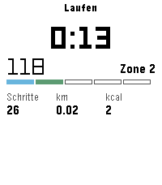
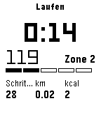
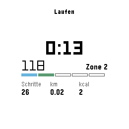

# Kieselsport

Trainingsaufzeichnung für die Pebble — **emery, flint und gabbro**.

Es gibt fertige Trainings-Apps für die Pebble, und gute. Diese hier hat einen
einzigen Grund: **sie trägt ihre Daten in dein Haus.** Auf Stop schickt die Uhr
eine Zusammenfassung; [Kiesel-Helper](https://github.com/dysseus-pascal/Kiesel-Helper)
hört mit und trägt sie in die Gesundheitsakte ein. Damit steht ein Lauf im
selben Wochenprofil wie Schlaf, Ruhepuls und Wasser — und in denselben
Zusammenhängen.

## Was sie zeigt

| emery | flint | gabbro |
|---|---|---|
|  |  |  |
| 200×228, Farbe | 144×168, schwarzweiss | 260×260, rund |

Derselbe Schirm auf allen dreien, und das ist nicht selbstverstaendlich: auf
flint fiel das dritte Feld urspruenglich unten aus dem Bild, auf gabbro stand
der Block zu weit oben und liess die breiteste Stelle des Kreises leer.

| | |
|---|---|
| **Zeit** | gross, in der Mitte — das ist die Zahl, die man im Laufen liest |
| **Puls** | daneben, dazu die Zone in Worten |
| **Zonenbalken** | fünf Felder, das erreichte gefüllt |
| **unten** | nur was die Sportart hergibt |

**Nicht jede Kennzahl passt zu jeder Art.** Schritte auf dem Bike sind eine
Zufallszahl — die Hand am Lenker wackelt — und eine Distanz kann die Uhr ohne
GPS nur aus Schritten schätzen; beim Krafttraining ist beides sinnlos. Jede Art
trägt deshalb mit, was sie kann:

| | Schritte | Distanz | Kalorien | eigenes |
|---|---|---|---|---|
| Laufen | ja | ja | ja | |
| Bike Strasse/Gravel | — | — | ja | |
| Wandern | ja | ja | ja | |
| Kraft | — | — | ja | **Sätze, Wiederholungen, Pause** |
| Bike MTB | — | — | ja | |
| Yoga | — | — | ja | |
| Schwimmen | — | — | ja | **Bahnen, und daraus die Strecke** |

Kalorien gelten überall: sie hängen am Puls und an der Bewegung, nicht an
Schritten.

## Der Zonenwechsel ist der Punkt

Steigt der Puls in die nächste Zone, brummt die Uhr **zweimal kurz**; fällt er
zurück, **einmal**. Wer läuft, soll das unterscheiden können, ohne hinzusehen.
Das ist die einzige Stelle, an der die App von sich aus etwas sagt — und der
eigentliche Grund, sie beim Sport zu tragen.

**Unter Zone 1 steht »< Zone 1«**, nicht »Zone 0«. Zone 1 beginnt bei 50 % des
Maximalpulses — bei 190 also bei 95. Wer darunter liegt, ist in keiner Zone,
und der Balken bleibt leer.

**Ein alter Wert steht grau da und trägt keine Zone.** Der Sensor am Handgelenk
behält den letzten guten Wert, wenn er nichts Brauchbares misst — am Lenker,
bei kalter Haut, mit lockerem Band. Dann stand eine halbe Stunde lang »75« in
Schwarz, als wäre es gemessen. Seit 0.5.2 beobachtet die App den Sensor:
meldet er sich neunzig Sekunden lang nicht und ändert sich der Wert nicht,
gilt er als alt, wird grau und mit »alt« gezeigt, zählt nicht in den Schnitt
und wechselt keine Zone. Das Band enger und das Handgelenk vom Lenker weg
hilft mehr als jede Rechnung.

Die Zonen rechnen sich aus deinem **Maximalpuls**, und der steht in der
Konfigseite. »220 minus Alter« ist eine Faustformel mit einer Streuung von gut
zehn Schlägen nach oben wie unten; aus ihr Zonen zu rechnen und sie dann als
Messung zu zeigen, wäre eine Behauptung.

## Zwei Dinge, die leicht danebengehen

**Die Summen werden nicht mitgezählt, sondern abgezogen.** Die Uhr führt
Schritte, Distanz und Kalorien ohnehin über den ganzen Tag; ein Training ist
die Differenz zwischen Anfang und Ende. Selbst zu zählen hiesse, dieselbe
Messung ein zweites Mal zu machen — mit eigenen Fehlern.

**Die dichte Pulsmessung bleibt aktiv, nachdem die App endet.** So steht es in
der Dokumentation von `health_service_set_heart_rate_sample_period`, und es ist
die teuerste Falle dieser App: wer sie beim Beenden nicht zurücksetzt, misst
noch stundenlang im Sekundentakt weiter und saugt den Akku leer. Deshalb
steht das Zurücksetzen an **jeder** Stelle, an der ein Training endet — beim
Stop, bei der Pause und beim Verlassen der App.

## Bedienung

| | |
|---|---|
| **Select** | Start — danach Pause und Weiter im Wechsel |
| **Oben** | in der Pause: **speichern** |
| **Unten** | in der Pause: **verwerfen** — zweimal drücken, damit kein Fehlgriff ein Training kostet |
| **Zurück** | die App verlassen; **das Training läuft im Hintergrund weiter** |

**Die Leiste rechts zeigt, was die Tasten gerade tun** — auf der Höhe der
Taste, als Zeichen: ein Dreieck für Start, zwei Balken für Pause, in der Pause
eine Diskette neben Oben und ein Abfalleimer neben Unten; beim zweiten Druck
steht ein Fragezeichen am Eimer. Drei Tasten mit drei Bedeutungen, die vom
Zustand abhängen, merkt sich niemand — und ein Fehlgriff kostete früher ein
Training. Was eine Taste gerade nicht tut, steht auch nicht da.

### Das Timeline-Design

Seit 0.7.0 sieht Kieselsport aus wie Drinktervall und Flynformer: weisser
Grund, schwarze Schrift, rechts eine violette Leiste — Blau und Orange sind
an die beiden anderen vergeben, und keine Pulszone ist violett. Der laufende Schirm
ist gebaut wie ein Eintrag der Pebble-Timeline — oben die Uhrzeit, dann eine
kleine Zeile mit der Sportart, die grosse Zahl in LECO, darunter Puls und Zone
mit dem Balken und die kleinen Felder. Oben in der Leiste sitzt ein **Herz**:
hohl, solange kein Puls da ist, sonst in der Farbe der Zone gefüllt — das sieht
man aus dem Augenwinkel, ohne eine Zahl zu lesen. Auf Schwarzweiss ist die
Leiste schwarz und das Herz weiss.

**Erst Select startet.** Die Wahl der Sportart öffnet den Schirm, aber die Zeit
läuft nicht schon, während man das Band noch richtet.

**Speichern und Verwerfen gibt es nur aus der Pause.** Beim Laufen soll ein
Druck auf die falsche Taste nichts tun; die Hand am Ärmel trifft die obere
leicht. Ein Training unter einer Minute wird auch beim Speichern verworfen —
ein Fehlgriff im Menü soll das Archiv nicht füllen.

### Das Training läuft im Hintergrund

Seit 0.6.0 misst nicht die App, sondern ein **Hintergrund-Worker** — ein
kleiner Teil der App, den die Uhr weiterlaufen lässt, wenn man mit Zurück aufs
Zifferblatt geht. Er zählt die Sekunden, liest den Puls, zählt Sätze und Bahnen
und brummt beim Zonenwechsel. Die App ist nur noch Anzeige und Tasten: sie
bekommt jede Sekunde den Stand vom Worker und schickt ihm Befehle.

Beim ersten Start fragt die Uhr einmal, ob Kieselsport im Hintergrund laufen
darf. Ohne dieses Ja läuft nichts.

**Im Startmenü steht, dass gezählt wird.** Ein Banner auf dem Zifferblatt, wie
es die eingebaute Workout-App hat, gibt die Uhr fremden Apps nicht. Was sie
lässt, ist die Zeile unter dem Namen im Startmenü — der *App Glance*: »Laufen
im Hintergrund, seit 25 min«. Die Zeit zählt die Uhr dort selbst weiter, und
ein Tippen auf Kieselsport öffnet gleich den laufenden Schirm, nicht das Menü.

**Brummen kann nur die App.** Der Worker darf die Uhr nicht vibrieren lassen.
Er merkt sich, was fällig ist — Zonenwechsel, Pause um —, und die App brummt,
sobald sie es hört. Ist die App zu, holt der Worker sie für einen
Zonenwechsel nach vorn: das Zifferblatt weicht dem Training, die Uhr brummt.
Das ist der Preis dafür, dass der Zonenwechsel auch im Hintergrund etwas
sagt — und er ist der Grund, die Uhr beim Sport zu tragen.

**Warum der Worker nicht mit dem Telefon redet:** er darf nicht. AppMessage
gibt es nur in der App. Beim Speichern legt der Worker die Zusammenfassung
deshalb in den Persist, und die App schickt sie — und fasst nach, bis das
Telefon sie bestätigt hat, auch beim nächsten Start noch.

## Krafttraining: Sätze ohne Knopfdruck

Wer eine Hantel hält, drückt keine Taste. Die Uhr merkt deshalb selbst, was
läuft:

* **Wiederholungen** aus der Bewegung des Handgelenks — 25 Messungen je
  Sekunde, Schwerkraft abgezogen, und gezählt wird nur, was vorher unten
  *war*. Ein Schmitt-Trigger, keine blosse Schwelle: sonst zählte ein Zittern
  an der Grenze zwanzig Wiederholungen in einer Sekunde.
* **Ein Satz ist zu Ende**, wenn vier Sekunden lang nichts mehr passiert, und
  der nächste beginnt mit der nächsten Bewegung. Vier, weil kurzes Absetzen
  mitten im Satz vorkommt.
* **Die Pause läuft mit** und die Uhr brummt einmal, wenn sie um ist. Das ist
  der eine Dienst, den hier nur die Uhr leisten kann: man hat die Hantel in
  der Hand und schaut nirgendwo hin.

**Die grosse Zahl ist nicht die Zeit.** Während eines Satzes stehen dort die
Wiederholungen, danach die Pause; die Gesamtzeit rutscht klein daneben. Was
man im Studio wissen will, wechselt alle vierzig Sekunden — der Schirm zeigt,
was gerade gilt.

**Das Zählen ist eine Schätzung, und das steht auch in der App.** Bei Curls,
Bankdrücken und Schulterdrücken bewegt sich das Handgelenk mit jeder
Wiederholung; bei Kniebeugen mit der Stange im Nacken bewegt es sich kaum, und
dann zählt die Uhr zu wenig oder nichts. **Die Pause dagegen misst sie
zuverlässig** — dafür muss sie nur merken, dass nichts mehr geschieht. Sie ist
auch die Zahl, die über das Ergebnis entscheidet.

Wie deutlich eine Bewegung sein muss, steht in den Einstellungen (träge /
normal / fein). Diese Schwelle hängt an der Übung, am Gewicht und daran, wie
jemand sich bewegt; eine fest eingebaute Zahl wäre geraten und nicht
nachstellbar.

## Schwimmen: Bahnen ohne GPS

Ein Becken hat eine Achse. Man schwimmt sie hinunter und wieder hinauf, und
bei jeder Wende dreht sich die Richtung um 180 Grad. **Wer die
Richtungswechsel zählt, zählt Bahnen** — mit dem Magnetometer, das unter
Wasser arbeitet, wo GPS nichts empfängt.

Mal der **Beckenlänge** aus den Einstellungen ergibt das eine Strecke: die
einzige in dieser App, die ohne GPS entsteht.

Warum nicht der Beschleunigungsmesser: der sieht Züge, keine Wenden, und eine
Wende ist beim Kraulen kaum von einem kräftigen Zug zu unterscheiden. Die
Richtung dagegen ist eindeutig — sie ist entweder die eine oder die andere.

**Der Kompass muss nicht nach Norden zeigen.** Gezählt wird der *Wechsel*
zwischen zwei Richtungen, nicht die Richtung selbst; die Achse ist einfach
die, in die zuerst geschwommen wurde. In einer Halle voller Stahl zeigt ein
Magnetometer ohnehin irgendwohin, und das macht hier nichts.

Drei Vorkehrungen, und jede steht für einen Fehler, den man sonst im Protokoll
fände:

* **Als Vektor gemittelt, nicht als Zahl.** Der Mittelwert aus 350 und 10 Grad
  ist 0 und nicht 180 — wer Winkel wie Zahlen mittelt, bekommt bei jedem
  Nulldurchgang eine Wende, die es nicht gab.
* **120 Grad statt 90**, damit ein Schlenker nicht schon eine Wende ist, und
  **frühestens nach acht Sekunden** — schneller wendet niemand.
* **Zehn Sekunden Einschwingen** am Anfang: so lange sucht die Uhr die Achse
  und zählt nichts.

Ist der Kompass nicht bereit, sagt der Schirm das, statt eine Null zu zeigen.
Eine Null bei den Bahnen sähe aus wie »du bist noch keine geschwommen«.

**Was im Wasser nicht zu trauen ist: der Puls.** Ein optischer Sensor misst
durch Wasser zwischen Haut und Glas schlecht; die Zahl steht da, aber sie ist
weicher als an Land. Die Bahnen sind davon unberührt.

## Was sie schickt

| Feld | Nummer | Bedeutung |
|---|---|---|
| `ART` | 10000 | 0 Laufen, 1 Strasse/Gravel, 2 Wandern, 3 Kraft, 4 MTB, 5 Yoga, 6 Schwimmen |
| `BEGINN` | 10001 | Unix-Sekunden |
| `DAUER` | 10002 | Sekunden ohne Pausen |
| `SCHRITTE` | 10003 | |
| `METER` | 10004 | |
| `KCAL` | 10005 | |
| `PULS_MITTEL` | 10006 | |
| `PULS_MAX` | 10007 | |
| `MAXPULS` | 10008 | **hinein**, aus der Konfigseite |
| `ZUSTAND` | 10009 | 0 Stop, 1 Start, 2 Pause, 3 Weiter |
| `BECKEN` | 10010 | **hinein**, Beckenlänge in Metern |
| `PAUSENZIEL` | 10011 | **hinein**, Sekunden bis zum Brummen |
| `EMPFIND` | 10012 | **hinein**, 1 träge, 2 normal, 3 fein |
| `SAETZE` | 10013 | Kraft |
| `REPS` | 10014 | Kraft, alle Wiederholungen |
| `BAHNEN` | 10015 | Schwimmen |
| `ABSCHNITTE` | 10016 | `beginn:anzahl:dauer;…`, je Satz oder Bahn |

**Die Abschnittsliste ist das, was den Tag später erklärt.** »4 Sätze« sagt
wenig, »12/10/8/8 mit 90 Sekunden dazwischen« sagt alles — und auf dem
Telefon wird jeder Abschnitt ein eigener Eintrag in der Gesundheitsakte:
ein Satz beim Krafttraining, eine Bahn beim Schwimmen. Zwanzig stehen
einzeln da; was darüber hinausgeht, zählt weiter mit, aber nicht mehr
namentlich.

Die Nummern ergeben sich aus der Reihenfolge der `messageKeys` in der
`package.json`, beginnend bei 10000. **Wer dort eine Zeile dazwischenschiebt,
verschiebt alle folgenden** — und Kiesel-Helper trägt danach still die falschen
Werte ins falsche Feld.

Dasselbe gilt für die Reihenfolge der Sportarten in `art.c`: eine eingeschobene
Zeile macht aus jedem gespeicherten Wandern rückwirkend ein Krafttraining.

**Deshalb steht MTB am Ende und nicht neben Strasse/Gravel**, wo es
hingehörte. Die Zahl einer Art darf sich nie verschieben; die Reihenfolge im
Menü ist der Preis dafür. Was zusammengehört, sagt stattdessen der Obertitel
»Bike« unter beiden Namen.

**Strasse und Gravel sind eine Art, nicht zwei.** Sie unterscheiden sich im
Reifen, nicht in dem, was diese Uhr davon sieht: Puls, Zeit, Kalorien. Was
sich wirklich anders anfühlt, ist das Gelände — und dafür steht MTB daneben.

Aus »Velo« wurde »Strasse/Gravel« — nur der Name, die Zahl blieb die 1.
Jede bisher aufgezeichnete Ausfahrt ist damit rückwirkend eine davon, und das
ist die einzige Annahme, die man hier treffen kann.

**0.3.0 war die eine Ausnahme von der Regel oben.** Sie hatte Strasse und
Gravel getrennt und dazwischen eine Zahl vergeben; sie stand zwanzig Minuten
lang im Netz und wurde von 0.4.0 abgelöst. Wer sie doch benutzt hat, findet
ein MTB als Gravel und ein Yoga als MTB wieder — zwei Aufzeichnungen, die man
in der Gesundheitsakte von Hand richtigstellt.

**Kein `companionApp`-Eintrag in der `package.json`.** Ein Paketname dort
schaltet die Pebble-App auf PebbleKit2 um — und damit fällt der klassische
Nebenempfänger weg, über den Kiesel-Helper überhaupt erst mithört.

## Die Strecke zeichnet das Telefon auf

Die Uhr hat **kein GPS**. Wo jemand gelaufen ist, weiss sie nicht und kann es
nicht wissen — das Telefon in der Tasche weiss es.

Damit es das kann, muss es wissen, **dass** gerade ein Training läuft. Deshalb
geht ab 0.2.0 bei jedem Tastendruck eine kurze Meldung hinaus:

| Was auf der Uhr | `ZUSTAND` | Was das Telefon tut |
|---|---|---|
| Start | 1 | Aufzeichnung an |
| Pause | 2 | Aufzeichnung aus |
| Weiter | 3 | Aufzeichnung an, dieselbe Datei |
| Stop | 0 | Aufzeichnung aus, Strecke an die Sitzung |

**Der Beginn muss schon in der Startmeldung mit.** Das Telefon legt die
Spurdatei unter diesem Zeitpunkt ab; erführe es ihn erst mit der
Zusammenfassung, hätte es die Punkte unter einem anderen Namen gesammelt.

**Das Ende steht in derselben Nachricht wie die Zusammenfassung**, nicht
daneben. Der Postausgang fasst genau eine Nachricht; eine zweite gleich
dahinter fiele still mit `BUSY` aus — und das Telefon zeichnete weiter auf,
nachdem das Training längst vorbei ist.

**Die Zustandsmeldungen fassen nicht nach, die Zusammenfassung schon.** Geht
ein Start verloren, fehlt die Strecke — ärgerlich, aber nicht schlimm. Geht die
Zusammenfassung verloren, ist das Training weg; die wartet deshalb und
versucht es erneut — **und überlebt seit 0.5.1 das Schliessen der App.** Bis
dahin lag sie nur im Speicher: hörte auf dem Telefon gerade niemand zu, etwa
weil Kiesel-Helper nach einem Update noch nicht wieder lief, fasste die Uhr
nach, solange die App offen war, und vergass die Zusammenfassung beim
Verlassen. Jetzt liegt sie im Persist, bis das Telefon sie bestätigt hat; der
nächste Start der App schickt sie noch einmal.

Die Uhr weiss von alldem nichts weiter. Sie misst und meldet; was daraus wird,
entscheidet [Kiesel-Helper](https://github.com/dysseus-pascal/Kiesel-Helper).

## Bauen

```bash
KIESELSPORT_SRC=<dieser Ordner> tools/sync_kieselsport.sh
```

Spiegelt nach `~/kieselsport` und baut dort — waf verträgt keine Pfade mit
Leerzeichen.

```bash
KIESELSPORT_SRC=<dieser Ordner> tools/sync_kieselsport.sh "" demo
```

Die `kieselsport.pbw` im Repo baut GitHub bei jeder Änderung an den Quellen
neu und checkt sie selbst ein (`.github/workflows/bauen.yml`). Steht in der
`package.json` eine Version, zu der es noch kein Release gibt, legt derselbe
Lauf das Release samt Tag und `.pbw` an. Sie stand einmal
vier Fassungen hinter den Quellen — wer sie installierte, bekam eine Uhr ohne
Startmeldung, ohne Sätze und ohne Bahnen.

Der Schalter `demo` erfindet Puls und Summen und springt gleich ins Training.
Ohne ihn lässt sich der laufende Schirm im Emulator nie ansehen: dort gibt es
weder einen Sensor noch einen Tastendruck von aussen.

## Was sie nicht tut

**Keine Karte auf der Uhr.** Kartenkacheln, Zoom und Speicherverwaltung auf
128 KB RAM wären ein eigenes Projekt — und auf 200×228 Punkten sähe man
nichts, was man auf dem Telefon nicht besser sieht. Die Strecke wird seit
0.2.0 vom Telefon aufgezeichnet und dort auch gezeigt: die Uhr misst, das
Telefon zeigt.

**Kein Zählen der Züge und keine Lagenerkennung.** Wie viele Züge eine Bahn
brauchte und ob es Brust oder Kraul war, liesse sich aus dem
Beschleunigungsmesser vielleicht herauslesen — vielleicht auch nicht. Solange
ich es nicht im Wasser geprüft habe, steht es nicht drin.

**Keine Navigation, kein Zurückfinden.** Dafür gibt es
[Kieselstrasse](https://github.com/dysseus-pascal/Kieselstrasse).

## Lizenz

[CC0 1.0](LICENSE) — gemeinfrei.
